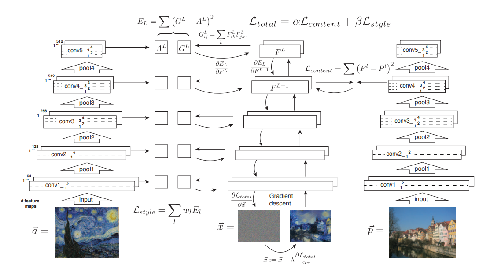

# Style Transfer using Convolutional Neural Networks

## Description
This is a project that transfers the style of an image (a) into another (b), with the purpose of keeping the picture or the shape of (b) but making it look different by trying to emule the style of (a). This project was inspired by the work of Leon A. Gatys, Alexander S. Ecker, Matthias Bethge. 

We take advantage of the trained algorithm VGG19 utilized for ImageNet and utilize some convolutional layers to come up with the cost function that merges content (b) features and style (a) features.

